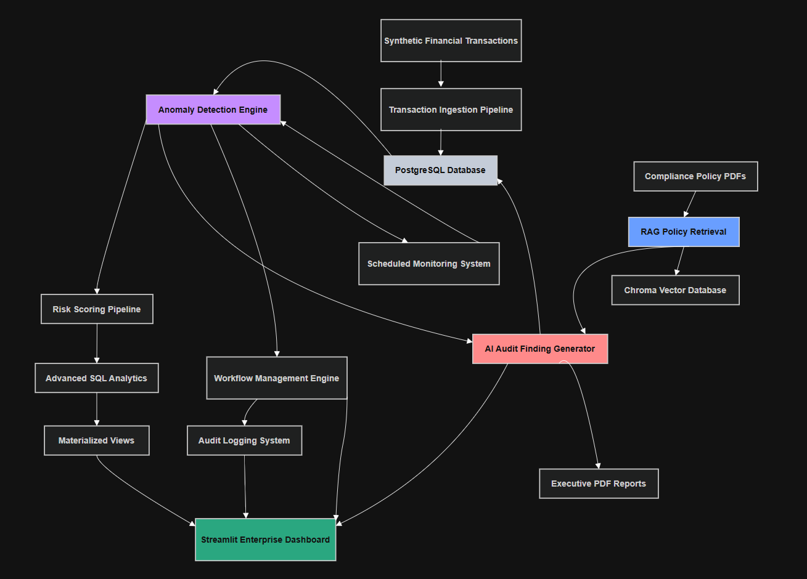
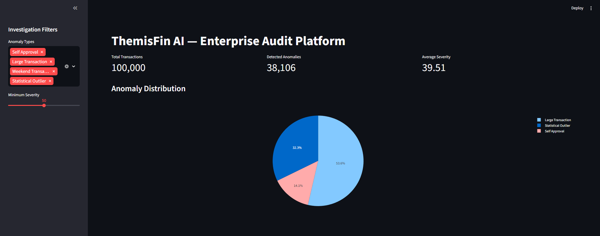
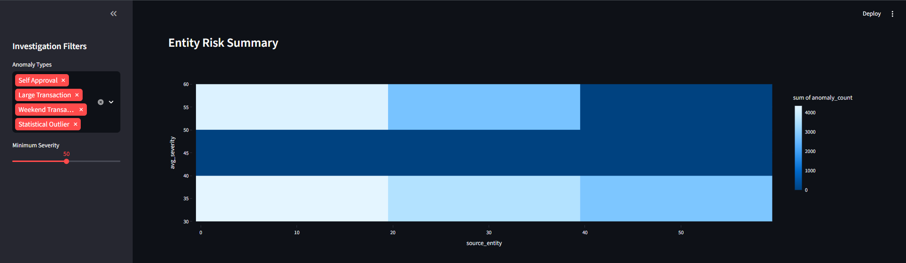
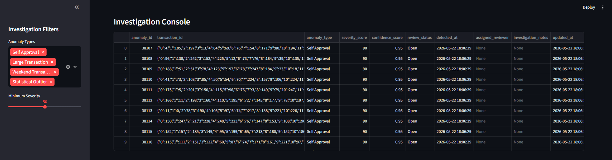
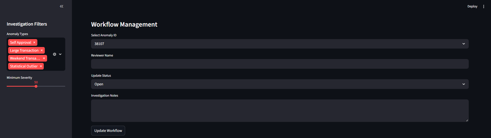
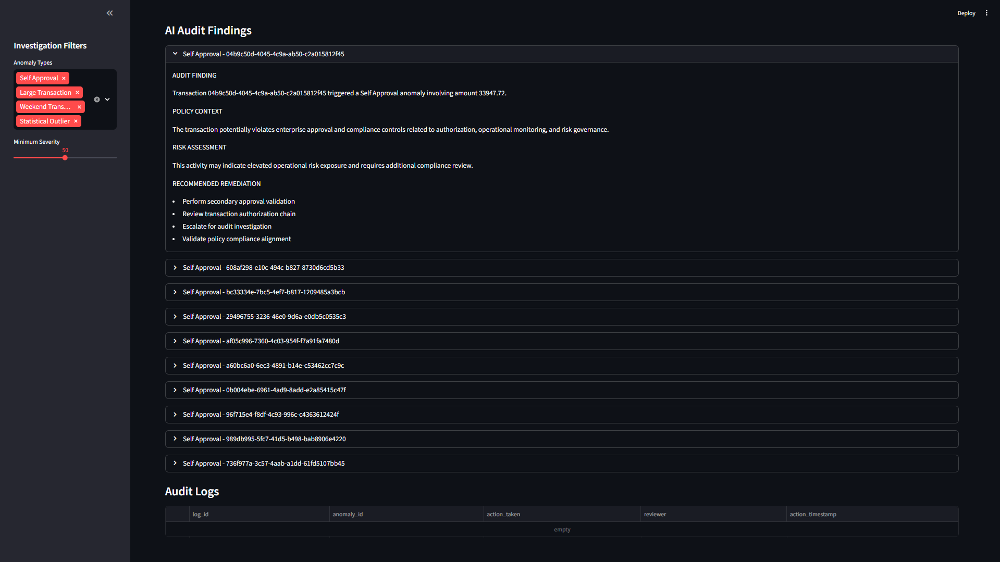

# ThemisFin AI

## Enterprise Financial Audit & Compliance Automation Platform

ThemisFin AI is an enterprise-style financial audit automation platform designed to simulate real-world compliance monitoring, anomaly detection, operational risk analysis, and AI-assisted audit workflows used in modern financial institutions.

The platform processes large-scale synthetic financial transaction data, performs automated anomaly detection using SQL and statistical analytics, retrieves relevant compliance policies using Retrieval-Augmented Generation (RAG), and generates AI-assisted audit findings through integrated compliance intelligence workflows.

---

# Key Features

## Financial Analytics & Monitoring
- Process and analyze 100K+ synthetic enterprise transactions
- Automated anomaly detection pipelines
- Risk scoring engine
- Advanced SQL analytics
- Materialized view optimization
- Operational monitoring dashboards

---

## AI-Powered Compliance Intelligence
- RAG-based policy retrieval
- ChromaDB vector database integration
- Semantic compliance search
- AI-generated audit findings
- Policy-aware remediation recommendations

---

## Enterprise Workflow Automation
- Investigation lifecycle management
- Reviewer assignment workflows
- Audit logging system
- Workflow state transitions
- Scheduled anomaly scans
- Compliance escalation workflows

---

## Dashboard & Reporting
- Streamlit operational dashboard
- KPI monitoring
- Risk heatmaps
- Investigation console
- AI audit report visualization
- Executive PDF report generation

---

# System Architecture



ThemisFin AI architecture demonstrating enterprise transaction ingestion, anomaly detection, AI-assisted compliance intelligence, workflow orchestration, operational monitoring, and executive reporting pipelines.

---

# Tech Stack

| Category | Technologies |
|---|---|
| Backend | Python |
| Database | PostgreSQL |
| ORM | SQLAlchemy |
| Data Processing | pandas, NumPy |
| Analytics | SciPy |
| Dashboard | Streamlit, Plotly |
| AI/RAG | LangChain, ChromaDB |
| Embeddings | Sentence Transformers |
| LLM Integration | Gemini API |
| Scheduling | APScheduler |
| Reporting | ReportLab |

---

# Project Structure

```text
themisfin-ai/
│
├── app/
│   ├── ai/
│   ├── analytics/
│   ├── dashboard/
│   ├── database/
│   ├── ingestion/
│   ├── scheduler/
│   └── utils/
│
├── data/
│   ├── policies/
│   └── chroma_db/
│
├── reports/
├── notebooks/
├── requirements.txt
├── .env.example
└── README.md
```

---

# Database Schema

Core entities:
- transactions
- anomaly_flags
- audit_logs
- ai_audit_reports
- entity_risk_summary

The platform uses PostgreSQL for:
- transactional storage
- analytical querying
- workflow persistence
- audit lifecycle management

---

# AI Compliance Workflow

ThemisFin AI uses Retrieval-Augmented Generation (RAG) to generate contextual audit findings.

Workflow:
1. Detect anomalous transaction
2. Retrieve relevant compliance policy
3. Generate AI-assisted audit finding
4. Produce remediation recommendations
5. Persist findings into PostgreSQL
6. Display results inside investigation dashboard

---

# Anomaly Detection Engine

Implemented detection mechanisms include:
- Self-approval detection
- Threshold violation analysis
- Weekend transaction monitoring
- Statistical outlier detection
- Burst transaction analysis
- Dormant entity reactivation analysis

---

# Advanced SQL Analytics

The platform includes:
- Window functions
- Materialized views
- Time-window analytics
- Rolling averages
- Entity risk aggregation
- Operational monitoring queries

Example:
```sql
AVG(amount) OVER (
    PARTITION BY source_entity
    ORDER BY timestamp
    ROWS BETWEEN 10 PRECEDING
    AND CURRENT ROW
)
```

---

# Workflow Lifecycle

Supported investigation states:
- Open
- Under Review
- Escalated
- Resolved
- False Positive

All workflow changes generate audit log entries for operational traceability.

---

# Dashboard Features

## Operational Monitoring
- Transaction KPIs
- Risk analytics
- Anomaly distribution
- Entity risk heatmaps

## Investigation Console
- Workflow updates
- Reviewer assignment
- Investigation notes
- Audit history

## AI Compliance Insights
- Generated audit findings
- Policy references
- Remediation recommendations

---

# Synthetic Dataset

The project generates:
- 100K+ synthetic financial transactions
- Multi-region enterprise entities
- Simulated operational anomalies
- High-risk transaction patterns

Injected anomaly patterns include:
- self approvals
- large transaction spikes
- weekend transactions
- dormant entity activation
- abnormal transaction bursts

---

# Scheduled Monitoring

The platform supports automated anomaly scanning using APScheduler.

Automated workflows:
- recurring anomaly scans
- compliance monitoring
- dashboard updates
- operational refresh pipelines

---

# Executive Reporting

ThemisFin AI supports:
- AI-generated audit reports
- PDF export generation
- executive compliance summaries
- investigation documentation

---

# Future Improvements

Planned enhancements:
- Power BI integration
- Real-time streaming ingestion
- Role-based authentication
- Kafka event pipelines
- Local LLM deployment
- Fraud graph analysis
- Multi-agent audit orchestration

---

# Dashboard Preview

## Enterprise Monitoring Dashboard



Enterprise audit monitoring dashboard with anomaly analytics, operational KPIs, and compliance investigation filters.

---

## Entity Risk Analytics



Entity-level operational risk visualization using aggregated anomaly severity and transaction analytics.

---

## Investigation Console



Investigation console for anomaly triage, severity analysis, workflow tracking, and operational audit review.

---

## Workflow Lifecycle Management



Workflow lifecycle management interface supporting reviewer assignment, escalation workflows, and investigation documentation.

---

## AI Audit Findings



AI-assisted compliance findings generated using Retrieval-Augmented Generation (RAG) and enterprise policy retrieval workflows.

---

# Resume-Relevant Engineering Areas

This project demonstrates:
- Backend Engineering
- SQL Engineering
- Analytics Engineering
- AI Systems Integration
- Workflow Automation
- Enterprise Dashboarding
- Compliance Automation
- RAG Architecture Design

---

# Disclaimer

This project uses synthetic financial data.